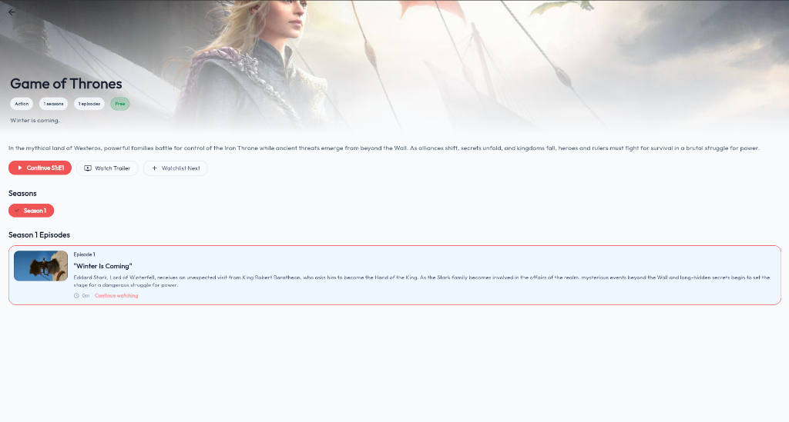
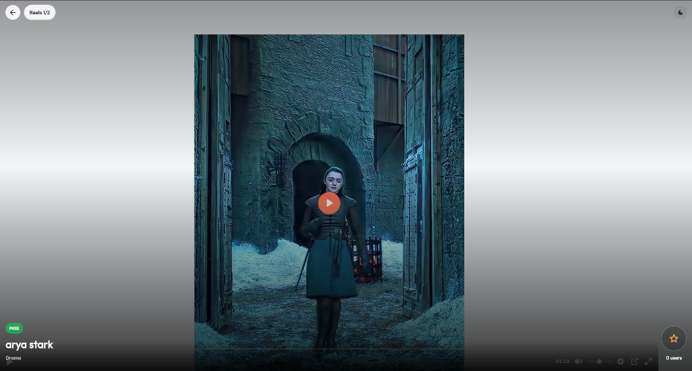
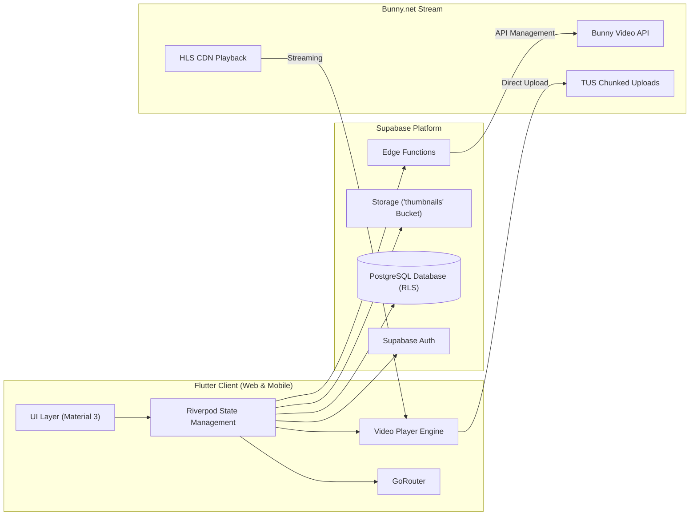

# ReelHouse OTT — Full-Stack Streaming Platform

<p align="center">
  <a href="https://ott-steel.vercel.app/"></a>
  <a href="https://github.com/oscarboyq/Ott/releases/latest"></a>
  
  
  
  
  
  
</p>

---

## 📌 Overview

**ReelHouse** is a full-stack Over-The-Top (OTT) media streaming application built with **Flutter** (Web & Android). It uses **Supabase** for user authentication, PostgreSQL database with Row Level Security (RLS), and thumbnail storage, paired with **Bunny Stream CDN** for chunked resumable video uploads and adaptive bitrate HLS video playback.

- 🌐 **Live Web Application:** [https://ott-steel.vercel.app/](https://ott-steel.vercel.app/)
- 📦 **Android Build:** [Download Latest Release APK](https://github.com/oscarboyq/Ott/releases/latest)

---

## 📸 Product Showcase

<p align="center">
  
  <br>
  <em>🎬 Home Catalog: Continue Watching rail with real-time watch progress, featured series, and reels shortcuts</em>
</p>

<p align="center">
  
  &nbsp;
  
  <br>
  <em>📺 Left: Multi-Season Series Engine with Episode Resume &nbsp;|&nbsp; 📱 Right: Fullscreen Vertical Reels Player</em>
</p>

<p align="center">
  
  <br>
  <em>🛠️ Admin Console: Video & Reel management, Bunny Stream transcoding status (READY / PROC), and access toggles</em>
</p>

---

## 🌟 Core Features

- **🎬 Video Catalog & Discovery**: Browse content with hero showcases, genre filtering (Action, Drama, Sci-Fi, etc.), live search, and categorized rails.
- **📊 Continue Watching & Progress Sync**: Tracks playback timestamps across videos and episodes, with visual progress bars and resume buttons.
- **📺 Multi-Season Series**: Hierarchical structure (`Series` ➔ `Seasons` ➔ `Episodes`) with individual episode progress tracking and details.
- **📱 Short-Form Reels**: Fullscreen vertical swipeable video player with gesture controls and overlay metadata.
- **🛠️ Admin Management Console**: Dedicated dashboard to upload videos/reels, monitor Bunny Stream transcoding status (`READY` / `0% PROC`), edit titles/genres, and toggle free access.
- **🔐 Authentication & RBAC**: Supabase Auth with role-based permissions (`User`, `Admin`, `Owner`) and database Row Level Security.
- **🎨 Theme Support**: Adaptive Material 3 design supporting both Dark and Light themes.

---

## 🏛️ Architecture



---

## 🧪 Testing

The codebase includes comprehensive unit and widget test coverage:

```bash
# Run static analysis
flutter analyze

# Run all automated tests
flutter test
```

**Test suite highlights (63 tests passing):**
- App startup and routing resilience (`widget_test.dart`)
- First-time installation and owner setup flow (`owner_setup_widget_test.dart`)
- Continue Watching resume calculation (`continue_watching_resume_test.dart`)
- Bunny TUS upload session serialization (`bunny_upload_session_test.dart`)
- Safe type parsing and database error handling (`safe_type_parsers_test.dart`)
- Playback source URL resolution (`playback_source_resolver_test.dart`)
- Light/Dark theme switching (`theme_provider_test.dart`)

---

## 🚀 Getting Started

### 1. Prerequisites
- **Flutter SDK**: 3.24+ (Dart 3.5+)
- **Supabase Account**: (Free cloud project or self-hosted)

### 2. Clone & Install Dependencies
```bash
git clone https://github.com/oscarboyq/Ott.git
cd Ott
flutter pub get
```

### 3. Configure Supabase
Copy the configuration template:
```bash
cp config/supabase.example.json config/supabase.json
```

Add your Supabase credentials in `config/supabase.json`:
```json
{
  "supabaseUrl": "https://your-project.supabase.co",
  "supabaseAnonKey": "your-anon-key"
}
```

### 4. Database Setup
Run the SQL script located at `assets/complete_database_setup.sql` in your Supabase SQL Editor to create tables, indexes, and Row Level Security policies.

### 5. Run the Application
```bash
# Run on Chrome (Web)
flutter run -d chrome

# Run on Android Device / Emulator
flutter run
```

---

## 📄 License

This project is licensed under the MIT License — see the [LICENSE](LICENSE) file for details.
