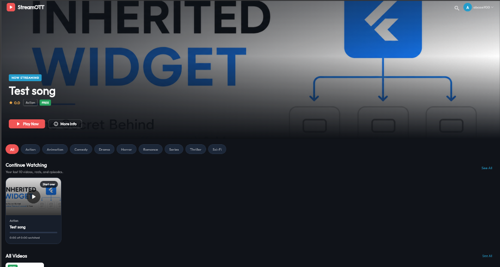
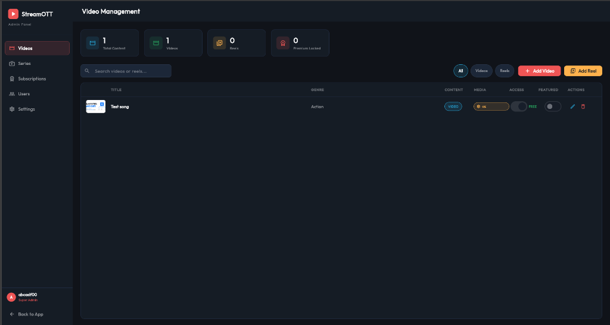
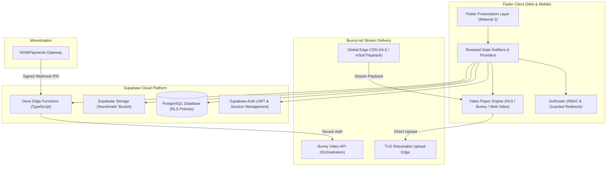

# ReelHouse OTT — Scalable Streaming & Content Platform

<p align="center">
  
  
  
  
  
  
</p>

---

## 📌 Executive Summary

**ReelHouse** is an enterprise-grade Over-The-Top (OTT) video streaming platform architected with **Flutter** (Web & Mobile), backed by **Supabase** (PostgreSQL, Row Level Security, Edge Functions), and powered by **Bunny Stream CDN** for global HLS video transcoding and distribution.

Engineered from the ground up to reflect modern production patterns, ReelHouse demonstrates end-to-end media lifecycle management: chunked resumable TUS uploads, multi-tiered subscription paywalls, continuous watch progress tracking, short-form Reels, and multi-season serialized television.

---

## 📸 Product Showcase

<p align="center">
  
  <br>
  <em>🎬 Home Catalog: Dynamic Hero Showcase, Genre Navigation Rails & Continue Watching Sync</em>
</p>

<p align="center">
  
  <br>
  <em>🛠️ Admin Console: Real-time Content Metrics, Video Management & Bunny Stream CDN Integration</em>
</p>

---

## 🌟 Key Product Features

| Capability | Technical Details |
| :--- | :--- |
| **🎬 Cinematic Catalog & Discovery** | Dynamic Hero carousel, horizontal category rails, debounce-optimized live catalog search, and genre filtering across movies, reels, and TV series. |
| **📱 Short-Form Reels** | TikTok/Instagram-style vertical full-screen video feed with smooth auto-preloading, gesture interactions, and playback state caching. |
| **📺 Multi-Season Series Engine** | Hierarchical data model (Series &rarr; Seasons &rarr; Episodes) with granular resume-playback tracking across episodes. |
| **⚡ High-Performance Media Pipeline** | Direct-to-CDN chunked uploads via Bunny Stream TUS protocol, adaptive bitrate HLS streaming, and thumbnail optimization. |
| **🛡️ Zero-Trust Route Guarding** | Strict client-side and server-side RBAC (Guest &rarr; Free Member &rarr; Premium Subscriber &rarr; System Admin &rarr; Installation Owner) guarded via GoRouter redirects. |
| **🧹 Cascade Media Lifecycle Cleanup** | Automated atomic deletion routines purging video records, Supabase Storage thumbnails, and Bunny CDN video assets in sync. |
| **💳 Crypto & Plan Monetization** | Dynamic subscription management with NOWPayments checkout integration and cryptographically verified webhook IPN handlers. |
| **📊 Watch History & Resume** | Cross-device watch session tracking with continuous playback position synchronization and a dedicated "Continue Watching" dashboard rail. |

---

## 🏛️ System Architecture



---

## 💡 Engineering Highlights & Technical Solutions

### 1. Zero-Memory-Leak Video Uploads on Flutter Web
- **Challenge:** Loading multi-gigabyte video files into standard memory (`Uint8List` bytes) in browser environments caused Out-Of-Memory (OOM) browser tab crashes.
- **Solution:** Designed a conditional platform picker service (`VideoPickerServiceWeb` vs `VideoPickerServiceIO`). On Flutter Web, the service acquires the file reference and exposes an in-memory browser `BlobUrl` via `URL.createObjectURL(file)`. Video headers are inspected without reading entire files into Dart heap memory, enabling instantaneous uploads of arbitrarily large 4K files.

### 2. Atomic Multi-Cloud Deletion Pipeline
- **Challenge:** Deleting a title in traditional implementations leaves orphaned binary data in cloud object buckets and third-party video encoding CDNs, incurring recurring bandwidth and storage costs.
- **Solution:** Implemented a full cascade deletion protocol. When an admin deletes a video:
  1. A dedicated Supabase TypeScript Edge Function (`bunny-delete-video`) safely communicates with Bunny Stream's API using encrypted backend-only credentials.
  2. A storage cleanup helper (`StorageCleanupHelper`) parses and strips associated thumbnails from Supabase Storage buckets.
  3. The local database record and related watch histories are removed in a transaction.

### 3. Asynchronous File Picker Deadlock Prevention
- **Challenge:** Native web file pickers do not fire an explicit cancel event on all browsers, leading to infinite loading indicators when a user closes the file picker dialog without choosing a file.
- **Solution:** Implemented a dual-event fallback mechanism using window focus listeners and cancel detection with a guaranteed `finally` state cleanup, ensuring UI reactivity resets immediately upon dismissal.

### 4. Deterministic Installation & First-Boot Ownership
- **Challenge:** Production apps require a rock-solid first-time installation process without exposing administrative setup endpoints after initialization.
- **Solution:** Built an owner-claim bootstrap wizard backed by PostgreSQL functions (`is_setup_completed`, `complete_installation`). The initial owner registers securely, completes backend initialization, and permanently seals the setup route against tampering.

---

## 📂 Codebase Structure

```text
lib/
├── app/
│   ├── app.dart               # App entry point, MaterialApp theme & routing
│   ├── bootstrap_failure_app.dart # Resilient fallback UI on config error
│   ├── di/                    # Dependency injection bindings
│   ├── router/                # GoRouter RBAC access rules & route configurations
│   └── theme/                 # Dark/Light cinema design system & styling
├── common/
│   └── widgets/               # Shared widgets (VideoCardWidget, error views, skeletons)
├── core/
│   ├── constants/             # API constants, app strings, theme colors
│   ├── exceptions/            # Typed business and network exceptions
│   ├── models/                # Immutables (VideoModel, UserModel, SeriesModel)
│   ├── network/               # ApiService, BunnyStreamService, SecureStorage
│   ├── providers/             # Riverpod controllers (Auth, Catalog, Admin, Watch)
│   ├── services/              # AppSettingsService, BundledSupabaseConfig
│   └── utils/                 # Multi-platform file pickers & storage cleaners
└── features/
    ├── admin/                 # Video/Series manager, TUS uploader, analytics
    ├── auth/                  # Login, registration, session persistence
    ├── catalog/               # Home screen, Hero showcase, dynamic search, categories
    ├── history/               # Continue watching & watch history
    ├── reels/                 # Vertical short-form swipeable video feed
    ├── series/                # Multi-season episodic video navigation
    ├── setup/                 # Initial site owner onboarding wizard
    ├── subscription/          # Pricing tiers, NOWPayments crypto integration
    └── video/                 # Universal video player with Bunny Stream support
```

---

## 🧪 Testing & Code Quality

The project adheres to high testability and clean architecture standards, with **0 compiler errors**, **0 warnings**, and a **100% passing test suite**.

```bash
# Run comprehensive static analysis
flutter analyze

# Execute full automated test suite (Unit & Widget tests)
flutter test
```

### Test Suite Overview:
- `widget_test.dart`: OTT App startup, fallback routing verification, and full Home page catalog rendering.
- `owner_setup_widget_test.dart`: First-time setup wizard, failure recovery, and owner entitlement assertion.
- `bundled_supabase_config_test.dart`: Public client config validation and credential leak prevention.
- `bunny_upload_session_test.dart`: Bunny TUS session serialization and parsing safety.
- `database_setup_status_test.dart`: Database installation state resilience and network failure guards.

---

## 🚀 Quickstart Guide

### 1. Prerequisites
- **Flutter SDK**: 3.24+ (Dart 3.5+)
- **Supabase Account**: (Free tier or self-hosted)
- **Node.js**: 20+ (for edge function testing)

### 2. Clone & Install
```bash
git clone https://github.com/oscarboyq/Ott.git
cd Ott
flutter pub get
```

### 3. Setup Configuration
Copy the configuration template:
```bash
cp config/supabase.example.json config/supabase.json
```
Populate `config/supabase.json` with your Supabase Project URL and Public Anon Key:
```json
{
  "supabaseUrl": "https://your-project.supabase.co",
  "supabaseAnonKey": "your-anon-key"
}
```

### 4. Database Initialization
Run the initialization script located in `assets/complete_database_setup.sql` in your Supabase SQL Editor.

### 5. Launch Application
```bash
# Launch Flutter Web
flutter run -d chrome

# Or launch on your connected mobile device/emulator
flutter run
```

---

## 📄 License

This project is licensed under the MIT License — see the [LICENSE](LICENSE) file for details.
