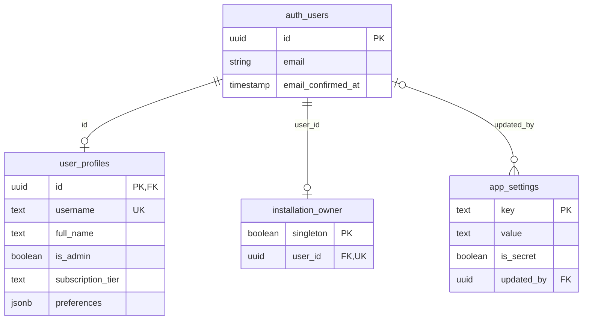
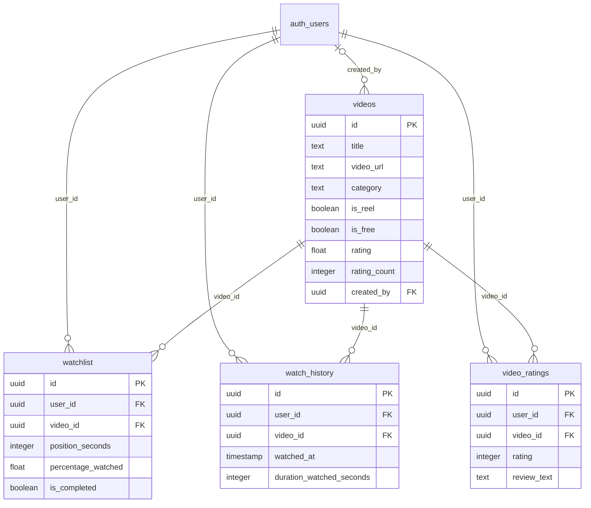
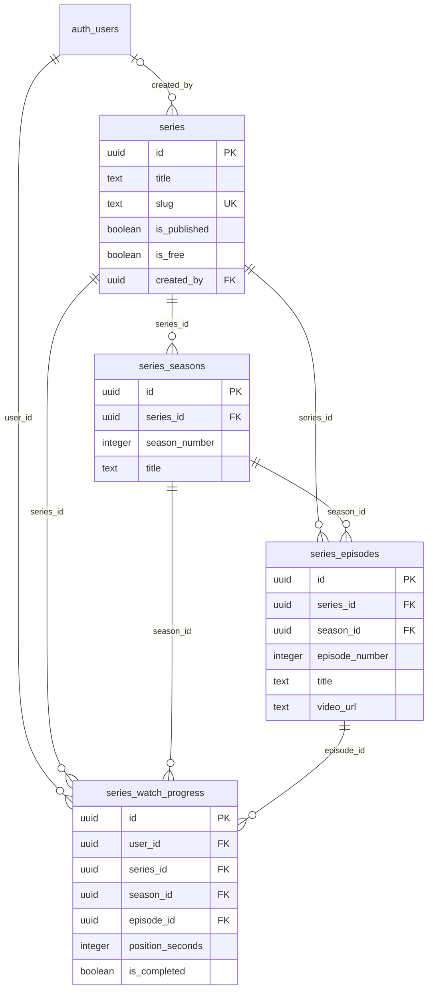
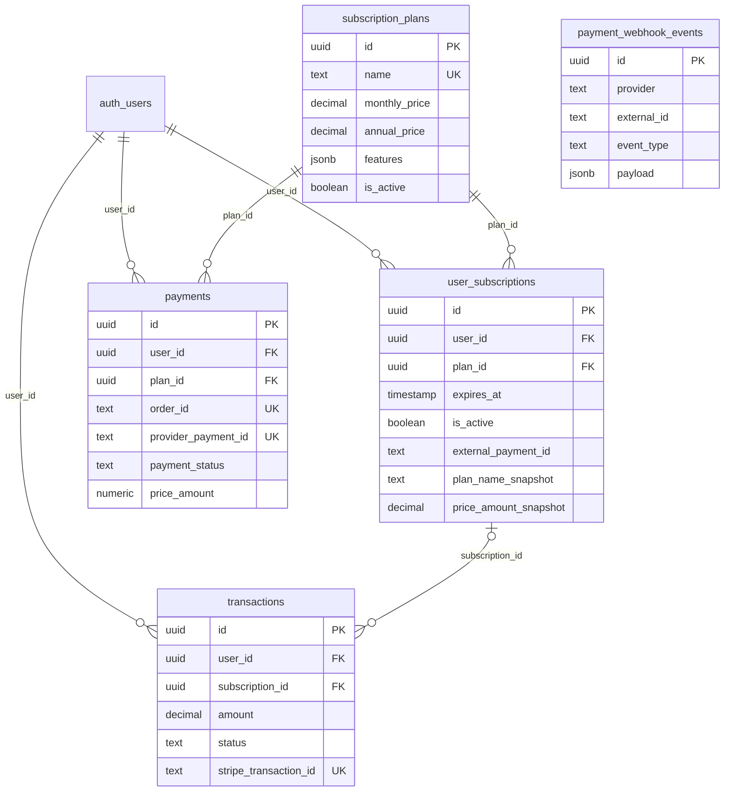

# ReelHouse database map

Based on the repository schema reviewed on 2026-09-06, not a live Supabase inspection. There are **16 application tables**, plus Supabase's managed `auth.users` table. A deployed database can differ if migrations have not been applied.

Sources: [complete schema](../assets/complete_database_setup.sql), [migrations](../supabase/migrations), [owner designation](../setup/designate_owner.sql), and [payment webhook](../supabase/functions/nowpayments-webhook/index.ts). The complete SQL copies in `assets/` and `setup/` currently match. These diagrams show selected columns, not every column or security policy.

## Reading the diagrams

- A **table** is like a spreadsheet; each row is one record.
- **PK** (primary key) uniquely identifies a row.
- **FK** (foreign key) points to a row in another table. It prevents references to nonexistent records.
- **UK** marks a unique value. Some uniqueness rules apply to a pair of columns, described below.
- `||` means exactly one; `o|` means zero or one; `o{` means zero or many.
- `auth_users` in the diagrams means the real table `auth.users`. All other tables are in `public`.
- Relationships below are actual foreign keys. They do not, by themselves, grant permission to read or change data.

## 1. Accounts and platform setup

`auth.users` holds login identities, managed by Supabase Auth. `user_profiles` holds app-specific information for the same ID; it does not store the user's password.

`installation_owner` allows **at most one row for the whole platform**, not one owner per customer. The database-only designation script selects that account. `is_admin` and installation ownership are separate concepts: an administrator is not automatically the installation owner.

`app_settings` stores shared key/value settings. For example, `setup_completed` is a **row key**, with text value `'true'` or `'false'`, not a column on each user.

The owner-only `complete_installation(platform_name)` function checks the owner and admin profile, then saves the app name and marks setup complete in one transaction. Rebuilding Flutter does not delete these rows. Keeping the same Supabase database and setup state means other browsers see the same installation status. An unreadable status must be treated as an error, not as a new installation.

## 2. Videos and viewer activity

Example: you save a video, watch it, and rate it. These are three different records pointing to the **same user ID and video ID**. The video title and URL need not be copied into each record.

Each of `watchlist`, `watch_history`, and `video_ratings` has a unique `(user_id, video_id)` pair. Consequently, history is not an unlimited log of separate viewing sessions; it allows only one row per user/video pair. Watchlist also contains playback-progress fields, not just bookmarks.

Reels use `videos.is_reel`; there is no separate reels table. Ratings have a 1–10 check, and a trigger attempts to refresh the aggregate rating/count on `videos`. The current rating column is nullable. Media columns contain URLs, not the video-file bytes.

## 3. TV series and episode progress

Think **show → season → episode**. Episodes have their own video URL; they do not reference `videos`.

Unique pairs prevent duplicate season numbers within a show, duplicate episode numbers within a season, and duplicate progress rows for the same user/episode.

The separate series/season/episode foreign keys verify that each referenced row exists. They do **not** ensure that all three belong to the same hierarchy. This is an improvement opportunity, not a guarantee of the current schema.

## 4. Subscriptions and payments

- `subscription_plans`: products offered, such as Free or Premium.
- `user_subscriptions`: a user's access period for a plan. Unique `(user_id, plan_id)` means renewals can update the existing row. Snapshot columns preserve plan details recorded during activation, but this is not a separate immutable record for every renewal.
- `payments`: NOWPayments checkout/payment state.
- `transactions`: a separate transaction table with a Stripe-specific identifier and an optional subscription link. Do not assume it mirrors NOWPayments records.
- `payment_webhook_events`: incoming provider event records. It has **no foreign key to payments**, so it is intentionally unconnected in this diagram.

The NOWPayments webhook code updates/upserts subscriptions after processing payment state. This is an **application workflow**, not a `payments → user_subscriptions` foreign key. `external_payment_id` and `parent_payment_id` are text identifiers, not declared foreign keys.

## Deletion behavior to understand before changing tables

| Parent removed | Current FK behavior |
| --- | --- |
| Auth user | Profile, viewer activity, subscriptions, payments, and transactions cascade; creator/settings references become null. Deleting the designated owner is blocked while the owner row references them. |
| Video | Its watchlist, history, and rating rows cascade. |
| Series or season | Related children and progress rows cascade according to their foreign keys. |
| Episode | Its progress rows cascade. |
| Subscription plan | Deletion is blocked while payments or subscriptions reference it. |
| User subscription | Referencing transactions remain, but `subscription_id` becomes null. |

These describe foreign-key behavior, not authorization to perform deletion. RLS and grants are a separate layer.

## Improvement roadmap — proposals, not implemented changes

1. **Enforce the episode hierarchy.** Add suitable composite foreign keys or remove redundant parent IDs after adapting queries. This prevents progress from mixing an episode with an unrelated season/show.
2. **Clarify payment history.** Decide the responsibilities of `payments` and `transactions`. Consider an explicit payment-to-access-grant relationship and immutable renewal records. Review webhook idempotency before adding a provider-event uniqueness rule; repeated status updates may be legitimate.
3. **Choose one authority for access.** Document whether subscription rows or `user_profiles.subscription_tier` determine entitlement. If both remain, define how they stay synchronized. Decide whether multiple active plans are allowed; the current unique pair does not prevent them.
4. **Separate bookmarks from progress if needed.** Watchlist currently does both. If you need session analytics, introduce a viewing-events table instead of treating the unique-per-video history as a full event log.
5. **Review consistency and visibility.** Standardize timestamp timezone handling and required fields. The complete schema and migrations differ on nullability for `videos.is_reel` and `videos.rating_count`. Also review published-content RLS: the current series SELECT policy uses `true`, not `is_published`.
6. **Use migrations for future changes.** Add a small versioned SQL migration, test with sample data, and update this document. Do not reset production or rerun the full fresh-install script just to add a feature.

No live database or application behavior was changed to create this guide.
